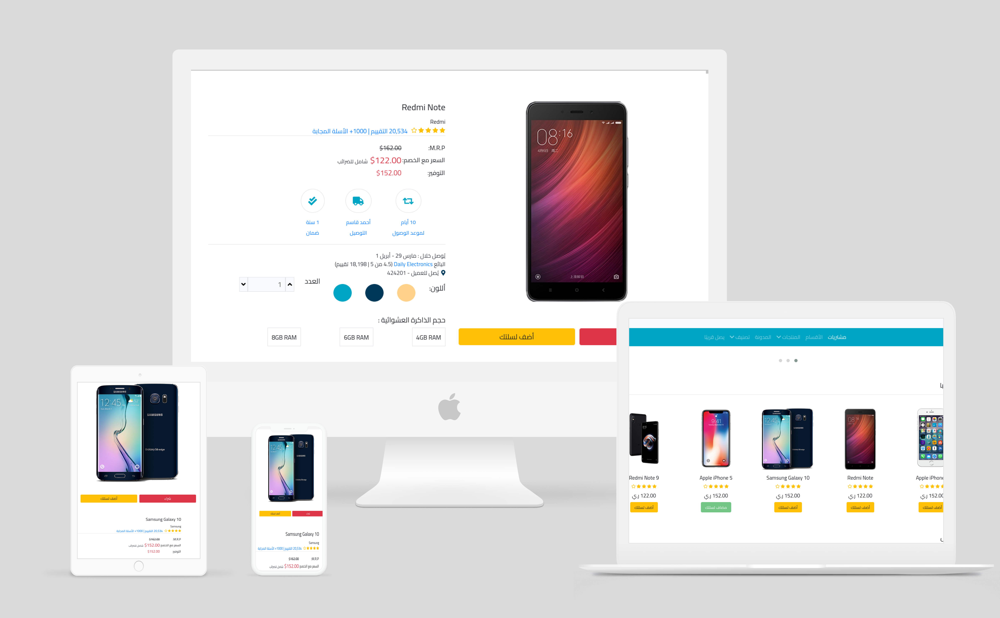

# Mobile Shop

Mobile Shop is a web application built to provide users with a platform to browse, search, and purchase mobile phones online. The website offers a user-friendly interface and a wide range of mobile phones from various brands.

## Features

- **Product Catalog**: Browse through a wide selection of mobile phones, each with detailed specifications and images.
- **Search Functionality**: Search for specific mobile phones by brand, model, or specifications.
- **Shopping Cart**: Add mobile phones to the cart for purchase, review cart contents, and proceed to checkout.
- **Order Management**: View order history, track orders, and update order status.

## Technologies Used

- HTML: Markup language for building the structure of web pages.
- CSS: Styling language to enhance the visual presentation of web pages.
- Bootstrap: Frontend framework for building responsive and mobile-first websites.
- JavaScript: Programming language for adding interactivity and dynamic behavior.
- jQuery: JavaScript library for simplifying DOM manipulation and event handling.
- PHP: Server-side scripting language for backend development.
- MySQL: Relational database management system for storing product and user data.
- Object-Oriented Programming (OOP): Programming paradigm used for organizing and managing code.

## Installation

To set up the Mobile Shop project locally, follow these steps:

1. Clone the repository: `git clone https://github.com/o2sa/mobile-shop.git`
2. Navigate to the project directory: `cd mobile-shop`
3. Import the SQL database file located in the `database` directory into your MySQL database.
4. Configure the database connection settings in the `config.php` file.
5. Start your local server (e.g., Apache, PHP built-in server).
6. Open your web browser and navigate to the local server's URL.

## Database Setup

1. Create a new MySQL database for the Mobile Shop project.
2. Import the provided SQL database file (`mobile_shop.sql`) into your newly created database.
3. Update the database connection settings in the `config.php` file with your database credentials.

# متجر الهواتف المحمولة

متجر الهواتف المحمولة هو تطبيق ويب تم بناؤه لتوفير منصة للمستخدمين لتصفح والبحث وشراء الهواتف المحمولة عبر الإنترنت. يقدم الموقع واجهة مستخدم سهلة الاستخدام ومجموعة واسعة من الهواتف المحمولة من مختلف العلامات التجارية.

## المميزات

- **كتالوج المنتجات**: تصفح مجموعة واسعة من الهواتف المحمولة، مع مواصفات مفصلة وصور.
- **وظيفة البحث**: البحث عن الهواتف المحمولة المحددة حسب العلامة التجارية، الطراز، أو المواصفات.
- **مصادقة المستخدمين**: نظام مصادقة مستخدم آمن يتيح للمستخدمين التسجيل، وتسجيل الدخول، وإدارة حساباتهم.
- **سلة التسوق**: إضافة الهواتف المحمولة إلى السلة للشراء، ومراجعة محتويات السلة، والانتقال لإكمال الطلب.
- **إدارة الطلبات**: عرض تاريخ الطلبات، وتتبع الطلبات، وتحديث حالة الطلبات.
- **لوحة التحكم للمسؤول**: لوحة تحكم للمسؤول لإدارة المنتجات، والفئات، والطلبات، وحسابات المستخدمين.

## التقنيات المستخدمة

- HTML
- CSS
- Bootstrap
- JavaScript
- jQuery
- PHP
- MySQL
- البرمجة الشيئية الموجهة (OOP): النمط البرمجي المستخدم لتنظيم وإدارة الشيفرة.

## التثبيت

لإعداد مشروع متجر الهواتف المحمولة محليًا، اتبع الخطوات التالية:

1. استنسخ المستودع: `git clone https://github.com/o2sa/mobile-shop.git`
2. انتقل إلى دليل المشروع: `cd mobile-shop`
3. استورد ملف قاعدة البيانات SQL الموجود في دليل `database` إلى قاعدة بيانات MySQL الخاصة بك.
4. قم بتكوين إعدادات اتصال قاعدة البيانات في ملف `config.php`.
5. ابدأ خادمك المحلي (مثل Apache، خادم PHP المضمن).
6. افتح متصفح الويب الخاص بك وانتقل إلى عنوان URL المحلي.

## إعداد قاعدة البيانات

1. قم بإنشاء قاعدة بيانات MySQL جديدة لمشروع متجر الهواتف المحمولة.
2. استورد ملف قاعدة البيانات SQL الموجود (`mobile_shop.sql`) إلى قاعدة البيانات الجديدة التي أنشأتها.
3. قم بتحديث إعدادات اتصال قاعدة البيانات في ملف `config.php` ببيانات الاعتماد الخاصة بقاعدة البيانات الخاصة بك.

